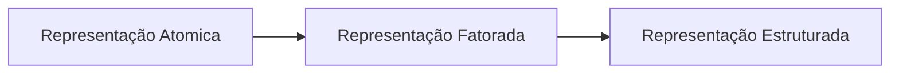

# Agentes e ambientes

Quando criamos um programa que possui algum nível de inteligência artificial
precisamos que ele tome decisões baseadas em algum ambiente. No caso, esse
programa acaba se tornando um agente, por tormar ações/decisões.

## Tipos de agentes

No assunto que estamos abordando, temos dois tipos de agentes:

- Agente Inteligente
- Agente Racional

### Agente Inteligente

Das características que formam um agente inteligente:

É esperado que um agente ineligente seja autônomo quanto suas decisões, ou seja,
ele deve ser capaz de tomar decisões sem a intervenção humana.

É necessário que ele consiga perceber o ambiente em que está atuando e que
consiga tomar decisões baseadas nessa percepção.

Persista por um período de tempo prolongado, para que consiga aprender e reter
esse conhecimento para tomar decisões futuras. Quanto mais conhecimento útil
um agente possui, mais inteligente ele é, desde que tenha distinção se o
conhecimento é obsoleto ou não, ou se o conhecimento está errado de alguma forma.

Também é esperado que esse agente adapte-se a mudanças no ambiente. Combinando
as características descritas acima, o agente consegue mudar seu comportamento
para se adaptar a mudanças no ambiente e melhorar seu resultado.

Um agente inteligente também deve ser capaz de criar e buscar objetivos, ou seja,
ele deve ser capaz de definir o que é um objetivo e como alcançá-lo.

> Esse último ponto sobre criar e buscar objetivos é algo que me chama atenção,
> pois não é algo totalmente autêntico em inteligências artificiais, visto que
> nós humanos possuimos objetivos que são definidos por nós mesmos, no caso,
> por desejo prório. Já uma inteligência artificial, por mais que seja capaz
> de definir objetivos, esses objetivos são definidos por um humano, ou seja,
> não é algo autêntico.
>
> Também é questionável se em algum momento na história uma inteligência conseguirá
> criar desejos próprios, de forma totalmente autêntica.

### Agente Racional

O agente racional tem como objetivo atingir resultados ótimos, ou se impossível
de obter um resultado ótimo devido a limitações, ele busca obter um resultado
o mais próximo possível do melhor resultado. Essa forma de buscar um resultado
é baseada na racionalidade.

# Racionalidade

A racionalidade de máquinas é um padrão matemáticamente definido pois usa
a lógica para tomar decisões, e a lógica por si só é matemática.
A abordagem de racionalidade é mais suscetível ao desenvolvimento científico
pois não leva em conta crenças e pseudo-ciências humanas, e sim resultados
comprovados sobre o objetivo alcançado.

Devido à abordagem comum para se desenvolver uma inteligência artificial ser
a racionalidade, é comum, mas não exclusivo, que as inteligências artificiais busquem reproduzir
o comportamento mais lógico possível, e não o comportamento mais humano possível.
Por ser mais comum, essa abordagem constitui o Modelo Padrão de inteligência artificial.

## Consequencialismo e Medida de Performance

Um agente racional irá tomar decisões baseadas em consequências, ou seja,
buscar boas consequências ao invés das más consequências. Para isso, é necessário
que o agente seja capaz de medir a performance de suas ações, para que possa
tomar decisões baseadas nessa medida. Essa medida de performance é chamada de
função de utilidade, e isso é inserido no programa pelo programador, de forma
explicita ou implicita. Por exemplo, um programa que joga xadrêz pode ter como
função de utilidade o número de peças que ele possui no tabuleiro.

> Em meus estudos de aprendizado de máquina, conheci essa função de utilidade 
> como o cálculo do gradiente estocástico descendente, que é uma forma de medir
> o quão bom é o resultado de uma ação para que em seguida o agente tome decisões
> a fim de achar um resultado ótimo local esperando que fosse o resultado ótimo global.

# Especificando o ambiente de tarefas

Essa parte trata de projetar um agente racional especificando o ambiente trabalhado
da forma mais completa possível. Para isso, podemos utilizar a descrição PEAS
(**P**erformance, **E**nvironment, **A**ctuators, **S**ensors).

## PEAS

### Performance
Define a medida de performance desejada.

### Environment
Define o ambiente em que o agente irá atuar.

### Actuators
Define as ações que o agente pode tomar.

### Sensors
Define como o agente irá perceber o ambiente.

> Por exemplo, se o agente for um carro autônomo, a medida de performance pode ser
> a distância percorrida, a velocidade atingida, o nível de segurança, e o consumo de gasolina.
> O ambiente pode ser uma pista de corrida, pedestres, outros carros e o clima.
> Quanto aos atuadores
> podem ser o volante, acelerador, marcha, freio e buzina.
> Já os sensores podem ser câmeras, sensores de distância e um GPS.

# Arquitetura do Agente

A arquitetura do agente é composta de um computador que possui sensores e atuadores.

# Tipos de Agente

# Representação de Estados

A representação Atomica é a mais simples, onde cada estado é representado por um
único valor onde estados são descritos com um único valor atômico, ou seja, não decomponível. Quando falamos da representação Fatorada, falamos que um estado
pode possuir atributos que fazem parte desse estado, por exemplo, um estado pode
ser representado por um conjunto de atributos como posição, velocidade e direção.
Já a representação Estruturada, é uma representação mais complexa pois não possui
apenas atributos, como também pode possuir objetos e esses objetos podem possuir
relações entre si.

Em questão de complexidade, podemos dizer que a representação atomica é mais simples
enquanto a representação estruturada é mais complexa e mais expressiva.

