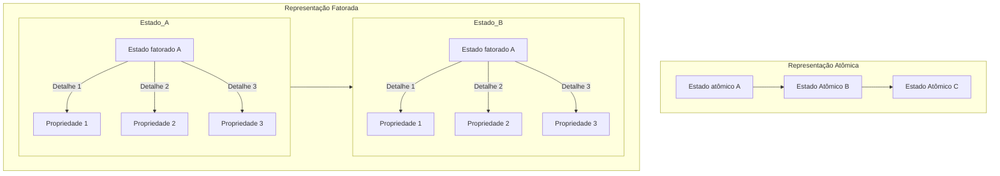

# **Problemas de Satisfação de Condições (CSPs)**

## Impressões iniciais

Como engenheiro de software, você provavelmente já se deparou com problemas 
complexos que envolvem várias condições e restrições. Nesse contexto, os 
Problemas de Satisfação de Restrições (CSPs) são extremamente relevantes.

Imagine que você está desenvolvendo um sistema de agendamento. 
Há várias variáveis em jogo: as disponibilidades de tempo, os recursos 
necessários, as preferências dos usuários, entre outros. 
Aqui, cada variável (X) representa um elemento desse sistema - por exemplo, 
um intervalo de tempo específico ou um recurso. Cada uma dessas variáveis tem 
um domínio (D), que é o conjunto de valores possíveis que ela pode assumir. 
Por exemplo, o domínio de um intervalo de tempo pode ser as horas do dia 
durante as quais uma sala está disponível.

Agora, as restrições (C) são as condições que determinam como essas variáveis 
podem ser combinadas. Por exemplo, uma sala não pode ser reservada para dois 
eventos diferentes ao mesmo tempo. O desafio em CSPs é encontrar uma 
atribuição para todas as variáveis que satisfaça todas essas restrições.

Resolver CSPs pode ser complexo, especialmente quando temos muitas variáveis e 
restrições. Uma abordagem é usar backtracking, que é um tipo de pesquisa em 
profundidade. Basicamente, você tenta uma solução, e se encontrar um conflito, 
volta atrás (backtrack) e tenta uma abordagem diferente. 
É um método poderoso, mas pode ser ineficiente para problemas muito grandes.

Outras técnicas incluem algoritmos de consistência local, que tentam reduzir o 
tamanho do problema eliminando valores que não podem fazer parte de uma solução 
válida. Também temos heurísticas de pesquisa, como a busca com propagação de 
restrições, que tentam antecipar e resolver conflitos antes que eles ocorram.

Em resumo, os CSPs são uma ferramenta poderosa em IA e ciência da computação, 
ajudando-nos a lidar com problemas complexos onde várias condições e restrições 
precisam ser satisfeitas simultaneamente. Eles são aplicáveis em uma variedade 
de campos, desde planejamento e agendamento até design de circuitos e jogos. 
Como engenheiros de software, entender e aplicar CSPs pode nos ajudar a criar 
soluções mais eficientes e eficazes para problemas complexos.

# Representação Atômica vs Fatorada

A representação atômica de um estado é similar a uma representação de caixa 
preta, ou seja, não temos informações sobre suas propriedades e componentes
internos. Quando temos uma representação mais complexa e expressiva, temos
uma representação fatorada, onde temos acesso aos atributos de um estado.

Ao trabalhar com CSPs, iremos dar ênfase a representação fatorada do estados 
pois precisamos ter uma visão mais granular sobre o problema, e tendo a 
possibilidade de quebrar o problema em subproblemas facilita a encontrar a
solução.

# Definindo Problemas de Satisfação de Condições

A idéia principal de usar uma CSP se baseia em achar uma solução eliminando
grandes porções do espaço de busca ao identificar condições neste espaço de
busca que impossibilitam o resultado.

Em termos mais técnicos, um CSPs são tipicamente definidas por três 
componentes:

- **Variáveis** (X): Um conjunto finito de variáveis que precisam ser resolvidas.
- **Domínios** (D): Um conjunto finito de valores que as variáveis podem assumir.
- **Restrições** (C): Um conjunto de condições que as soluções devem satisfazer.

Tendo definido isso, podemos dizer que CSPs lidam com atribuições de valores
às variáveis.
- Quando uma atribuição não viola nenhuma restrição, ela é chamada de
**consistente**;
- Quando todas as variáveis recebem um valor, a atribuição é **completa**;
- Quando nem todas as variáveis recebem um valor, a atribuição é **parcial**;

Então para definir uma **solução**, precisamos que ela seja 
**consistente e completa**. Logo, uma solução parcial é aquela que é completa
porém nem todas as variáveis são atribuias a algum valor.
Soluções de CSP são problemas NP-Completo em geral.

# Tipos de Condições

# Consistência

## Nó

## Arco

## Trajeto

## K

## Globais

# Algoritmos

# Estrutura de Problemas

# Discussões

# Projetos e problemas

# Bibliografia

https://folivetti.github.io/courses/IA/PDF/Aula04.pdf

https://en.wikipedia.org/wiki/AC-3_algorithm

https://www.cs.cmu.edu/~arielpro/15381f16/c_slides/781f16-3.pdf