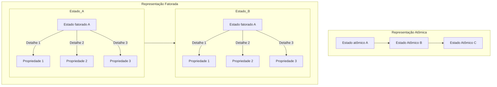

# **Problemas de Satisfação de Condições (CSPs)**

## Impressões iniciais

Como engenheiro de software, você provavelmente já se deparou com problemas 
complexos que envolvem várias condições e restrições. Nesse contexto, os 
Problemas de Satisfação de Restrições (CSPs) são extremamente relevantes.

Imagine que você está desenvolvendo um sistema de agendamento. 
Há várias variáveis em jogo: as disponibilidades de tempo, os recursos 
necessários, as preferências dos usuários, entre outros. 
Aqui, cada variável (X) representa um elemento desse sistema - por exemplo, 
um intervalo de tempo específico ou um recurso. Cada uma dessas variáveis tem 
um domínio (D), que é o conjunto de valores possíveis que ela pode assumir. 
Por exemplo, o domínio de um intervalo de tempo pode ser as horas do dia 
durante as quais uma sala está disponível.

Agora, as restrições (C) são as condições que determinam como essas variáveis 
podem ser combinadas. Por exemplo, uma sala não pode ser reservada para dois 
eventos diferentes ao mesmo tempo. O desafio em CSPs é encontrar uma 
atribuição para todas as variáveis que satisfaça todas essas restrições.

Resolver CSPs pode ser complexo, especialmente quando temos muitas variáveis e 
restrições. Uma abordagem é usar backtracking, que é um tipo de pesquisa em 
profundidade. Basicamente, você tenta uma solução, e se encontrar um conflito, 
volta atrás (backtrack) e tenta uma abordagem diferente. 
É um método poderoso, mas pode ser ineficiente para problemas muito grandes.

Outras técnicas incluem algoritmos de consistência local, que tentam reduzir o 
tamanho do problema eliminando valores que não podem fazer parte de uma solução 
válida. Também temos heurísticas de pesquisa, como a busca com propagação de 
restrições, que tentam antecipar e resolver conflitos antes que eles ocorram.

Em resumo, os CSPs são uma ferramenta poderosa em IA e ciência da computação, 
ajudando-nos a lidar com problemas complexos onde várias condições e restrições 
precisam ser satisfeitas simultaneamente. Eles são aplicáveis em uma variedade 
de campos, desde planejamento e agendamento até design de circuitos e jogos. 
Como engenheiros de software, entender e aplicar CSPs pode nos ajudar a criar 
soluções mais eficientes e eficazes para problemas complexos.

## Representação Atômica vs Fatorada

A representação atômica de um estado é similar a uma representação de caixa 
preta, ou seja, não temos informações sobre suas propriedades e componentes
internos. Quando temos uma representação mais complexa e expressiva, temos
uma representação fatorada, onde temos acesso aos atributos de um estado.



Ao trabalhar com CSPs, iremos dar ênfase a representação fatorada do estados 
pois precisamos ter uma visão mais granular sobre o problema, e tendo a 
possibilidade de quebrar o problema em subproblemas facilita a encontrar a
solução.

## Definindo Problemas de Satisfação de Condições

A idéia principal de usar uma CSP se baseia em achar uma solução eliminando
grandes porções do espaço de busca ao identificar condições neste espaço de
busca que impossibilitam o resultado.

Em termos mais técnicos, um CSPs são tipicamente definidas por três 
componentes:

- **Variáveis** (X): Um conjunto finito de variáveis que precisam ser resolvidas.
- **Domínios** (D): Um conjunto finito de valores que as variáveis podem assumir.
- **Restrições** (C): Um conjunto de condições que as soluções devem satisfazer.

Tendo definido isso, podemos dizer que CSPs lidam com atribuições de valores
às variáveis.
- Quando uma atribuição não viola nenhuma restrição, ela é chamada de
**consistente**;
- Quando todas as variáveis recebem um valor, a atribuição é **completa**;
- Quando nem todas as variáveis recebem um valor, a atribuição é **parcial**;

Então para definir uma **solução**, precisamos que ela seja 
**consistente e completa**. Logo, uma solução parcial é aquela que é completa
porém nem todas as variáveis são atribuias a algum valor.
Soluções de CSP são problemas NP-Completo em geral.

## Tipos de Condições


### Condições necessárias

Iremos dar ênfase aos seguintes tipos de condições:

- Unárias
- Binária
- Alta Ordem (Ternária+)
- Global

### Restrições Unárias
- **Conceito**: As restrições unárias são as mais simples em CSPs. 
Elas afetam uma única variável.
- **Exemplo**: Uma restrição que especifica que uma variável \( X \) deve 
ser maior que 5.

### Restrições Binárias
- **Conceito**: As restrições binárias envolvem duas variáveis e estabelecem 
uma relação entre elas.
- **Exemplo**: Uma restrição que exige que duas variáveis \( X \) e 
\( Y \) sejam diferentes entre si.

### Restrições de Alta Ordem (Ternária+)
- **Conceito**: As restrições de alta ordem envolvem três ou mais variáveis.
Elas são mais complexas que as unárias e binárias e permitem expressar relações
entre grupos de muitas variáveis.
- **Exemplo**: Uma restrição que determina que a soma das variáveis \( X, Y, \)
e \( Z \) deve ser igual a um valor específico.

### Restrições Globais
- **Conceito**: As restrições globais afetam um grande número de variáveis, às 
vezes todas em um CSP. 
Elas são úteis para expressar condições abrangentes que envolvem múltiplas 
variáveis.
- **Exemplo**: Uma restrição de que todas as variáveis em um conjunto devem 
ter valores diferentes, como na regra do Sudoku, onde cada número deve 
aparecer apenas uma vez em cada linha, coluna e bloco.

**Qualquer uma dessas condições de CSP podem ser reduzidas a condições biárias.**

## Condições de preferência

Ao contrário das condições necessárias, que são obrigatórias para resolução do
CSP, as condições de preferência servem para encontrarmos uma solução preferida.

**Por exemplo:**
> Em um jogo onde um mago precisa atravessar o campo de batalha,
> ele tem diversos caminhos para escolher que satisfazem as condições que o mago
> irá chegar ao outro lado do campo vivo e sem atacar nenhum aliado. Mas o mago
> pode preferir ir por um caminho onde ele enfrente o máximo de inimigos, 
> ou então pode preferir ir por um caminho onde há mais espólios, ou então pode
> preferir ir por um caminho onde ele perca o mínimo de vida possível. Isso tudo
> são preferências, e não uma condição obrigatória.

## Propagação de condição

Para ocorrer a propagação de condições, um algoritmo CSP reduz o domínio de
valores que uma variável pode assumir, que pode reduzir o domínio de outra
variável e assim sucessivamente. O objetivo de propagação de condições é
garantir a consistência local.

Para explicar o parágrafo acima, iremos explicar como ocorre o funcionamento
da propagação de condições em CSPs:

### Funcionamento

**Redução de Domínio**: Inicialmente, cada variável em um CSP tem um 
conjunto de possíveis valores que pode assumir (seu domínio). Quando 
uma restrição é aplicada, o domínio de uma variável pode ser reduzido. 
Por exemplo, se temos uma variável \( X \) com um domínio de {1, 2, 3, 4, 5} e
uma restrição unária \( X > 2 \), o domínio de \( X \) é reduzido para 
{3, 4, 5}.

**Efeito Cascata**: Esta redução pode ter um efeito cascata. Considerando 
uma restrição binária entre \( X \) e \( Y \), a alteração no domínio de 
\( X \) pode levar a uma redução no domínio de \( Y \). Por exemplo, se 
\( Y \) deve ser diferente de \( X \) e o novo domínio de \( X \) é {3, 4, 5}, 
então os valores correspondentes são removidos do domínio de \( Y \).

**Consistência Local**: O objetivo da propagação é alcançar a 
consistência local. Isso significa que para cada variável e suas restrições 
diretas (com outras variáveis), existe pelo menos uma atribuição válida que 
satisfaz as restrições.

### Impacto no Desenvolvimento de Software

Para um engenheiro de software, a questão de propagação de condições pode ter
as seguintes importâncias:

- **Otimização de Algoritmos**: Utilizar a propagação de condições em CSPs pode
significar a diferença entre um algoritmo que resolve problemas em tempo hábil e
um que não é viável para uso prático.

- **Complexidade Computacional**: A propagação eficaz de condições pode reduzir
drasticamente o espaço de busca, diminuindo a complexidade computacional do
problema.

- **Aplicações Práticas**: Em sistemas de agendamento, planejamento de recursos,
ou em soluções de problemas lógicos como Sudoku, a propagação de condições é uma
técnica essencial para garantir soluções eficientes.

Em resumo, a propagação de condições em CSPs é uma técnica fundamental para 
qualquer engenheiro de software envolvido na solução de problemas complexos que 
requerem otimização e eficiência. Ela não só reduz o espaço de busca, como 
também assegura a consistência local das soluções, dois aspectos cruciais para a 
eficiência dos sistemas que desenvolvemos e mantemos.


## Consistência


### Consistência de Nó

A consistência de nodo ocorre quando todas as restrições unárias são 
satisfeitas. Isso significa que cada variável individualmente deve satisfazer 
as restrições que lhe são impostas. É o tipo mais básico de consistência e 
geralmente é o ponto de partida para algoritmos de CSP. Envolve a verificação e 
a adequação dos domínios de variáveis individuais para atender a restrições 
unárias.

### Consistência de Arco

Um arco entre duas variáveis \(X\) e \(Y\) é consistente se, para cada valor no 
domínio de \(X\), existe algum valor no domínio de \(Y\) que satisfaça a 
restrição entre \(X\) e \(Y\). É crucial em CSPs com restrições binárias. 
Algoritmos como o AC-3 (Algorithm for Arc Consistency) são usados para alcançar 
a consistência de arco, removendo valores dos domínios das variáveis que não 
podem participar de soluções válidas.

### Consistência de Trajeto

Um CSP é dito trajeto consistente se, para cada trio de variáveis, todas as 
combinações de valores que satisfazem as restrições binárias entre elas são 
compatíveis com as restrições terciárias aplicáveis. É mais complexa e menos 
comum que a consistência de nodo e arco. Envolve a consideração de trios de 
variáveis e é útil em CSPs onde as relações entre três variáveis são cruciais.

### Consistência Global

Um CSP é globalmente consistente se, para cada subconjunto de variáveis e para 
cada atribuição possível a esse subconjunto que satisfaz as restrições sobre 
ele, é possível estender essa atribuição ao resto das variáveis sem violar 
nenhuma restrição. É o tipo mais forte de consistência, mas também o mais 
difícil de alcançar e verificar. Geralmente, não é prático verificar a 
consistência global para problemas grandes, mas é um objetivo desejável.

### Consistência K (k-Consistency)

Um CSP é k-consistente se para qualquer conjunto de \(k-1\) variáveis e uma 
atribuição consistente a essas variáveis, a extensão dessa atribuição a uma 
k-ésima variável é consistente com as restrições do CSP. A consistência k 
oferece um meio-termo entre a simplicidade da consistência de nó/arco e a 
complexidade da consistência global. A consistência 2, por exemplo, é 
equivalente à consistência de arco.

## Algoritmos

### Backtracking

É o algoritmo mais básico e direto para resolver CSPs. Ele tenta atribuir 
valores a cada variável sequencialmente e volta atrás (backtrack) quando uma 
restrição é violada. Utilizado em problemas de CSP mais simples e é a base para 
muitos outros algoritmos mais sofisticados.

#### Exemplo em Python:

```python
def backtrack(assignment, csp):
    # Verifica se a atribuição está completa
    if len(assignment) == len(csp.variables):
        return assignment

    # Seleciona uma variável ainda não atribuída
    var = select_unassigned_variable(assignment, csp)

    # Testa todos os valores possíveis para a variável
    for value in csp.domains[var]:
        # Checa se a atribuição atual é consistente com as restrições do CSP
        if is_consistent(var, value, assignment, csp):
            assignment[var] = value  # Atribui o valor à variável
            result = backtrack(assignment, csp)  # Continua recursivamente
            if result:
                return result  # Retorna a solução, se encontrada
            assignment.pop(var)  # Caso contrário, remove a atribuição e tenta outra

    return False  # Retorna False se nenhuma atribuição válida for encontrada
```

### Algoritmo de Arc Consistency (AC-3)

AC-3 é um algoritmo para alcançar a consistência de arco em CSPs. Ele examina 
sistematicamente pares de variáveis e elimina valores inconsistentes dos seus 
domínios. Comumente usado como um pré-processamento em CSPs para reduzir o 
espaço de busca antes de aplicar algoritmos como backtracking.

#### Exemplo em Python:

```python
def ac3(csp):
    # Inicializa a fila com todos os arcos do CSP
    queue = [(Xi, Xj) for Xi in csp.variables for Xj in csp.neighbors[Xi]]

    # Processa cada arco na fila
    while queue:
        Xi, Xj = queue.pop(0)  # Remove um arco da fila

        # Revisa o arco e atualiza o domínio de Xi se necessário
        if revise(csp, Xi, Xj):
            if not csp.domains[Xi]:
                return False  # Retorna False se o domínio de Xi ficar vazio

            # Adiciona novamente à fila todos os arcos que afetam Xi
            for Xk in csp.neighbors[Xi]:
                if Xk != Xj:
                    queue.append((Xk, Xi))

    return True  # Retorna True se todos os arcos forem consistentes

def revise(csp, Xi, Xj):
    """Revisa o domínio de Xi para garantir consistência com Xj.

    Args:
        csp: O problema de CSP, contendo variáveis, domínios e restrições.
        Xi: A variável cujo domínio está sendo revisado.
        Xj: A variável vizinha de Xi.

    Returns:
        True se houver alguma revisão no domínio de Xi, False caso contrário.
    """
    revised = False
    for x in csp.domains[Xi][:]:  # Copia do domínio para evitar modificar durante iteração
        # Se não existe nenhum valor em Xj que satisfaça a restrição com x, remove x do domínio de Xi
        if not any(is_satisfied(x, y, csp.constraints[Xi, Xj]) for y in csp.domains[Xj]):
            csp.domains[Xi].remove(x)
            revised = True
    return revised

def is_satisfied(x, y, constraint):
    """Verifica se a restrição entre x e y é satisfeita.

    Args:
        x: Valor da variável Xi.
        y: Valor da variável Xj.
        constraint: A restrição entre Xi e Xj.

    Returns:
        True se a restrição é satisfeita, False caso contrário.
    """
    # Implementação específica da restrição
    pass

```

### Min-conflicts

Um algoritmo de busca local que seleciona uma variável que está em conflito e 
muda seu valor para minimizar o número de conflitos. 
Particularmente eficaz em problemas com uma grande densidade de restrições. 
É útil em CSPs de grande escala onde uma solução ótima não é necessária, mas 
uma solução "boa o suficiente" é aceitável.

#### Exemplo em Python:

```python
import random

def min_conflicts(csp, max_steps=1000):
    def conflicts(var, value):
        # Conta o número de conflitos se 'var' for atribuído a 'value'
        return sum(1 for neighbor in csp.neighbors[var] if value == csp.assignment[neighbor])

    for _ in range(max_steps):
        # Identifica todas as variáveis que estão em conflito
        conflicted = [var for var in csp.variables if conflicts(var, csp.assignment[var]) > 0]

        # Se não há conflitos, a solução atual é retornada
        if not conflicted:
            return csp.assignment

        # Escolhe aleatoriamente uma variável em conflito
        var = random.choice(conflicted)

        # Escolhe o valor para 'var' que minimiza o número de conflitos
        value = min(csp.domains[var], key=lambda val: conflicts(var, val))

        # Atribui o valor escolhido a 'var'
        csp.assignment[var] = value

    return None  # Retorna None se nenhuma solução for encontrada dentro do limite de passos

# Nota: Este é um exemplo conceitual. A implementação real exigiria uma estrutura de dados CSP mais detalhada.
```

---

## Estrutura de Problemas

**Arvore de Busca e Pruning**: Utilizando árvores de busca para representar o 
espaço de busca, podemos dizer que os algoritmos de CSP são mais eficientes que os
algoritmos de procura tradicionais, pois eles conseguem realizar podas
eficientes na árvore de busca. Algoritmos de CSP são eficientes em 
identificar e descartar ramos da árvore de busca que não podem levar a 
soluções válidas. Isso é feito por meio da verificação de restrições: se uma 
atribuição parcial viola uma restrição, não há necessidade de explorar mais 
adiante nesse ramo.

A afirmação de que "algoritmos baseados em CSPs são, na prática, mais
eficientes que algoritmos de procura tradicionais" pode ser considerada 
correta em muitos contextos, especialmente em relação à capacidade desses 
algoritmos de realizar podas eficientes na árvore de busca, como no exemplo 
do problema de coloração do mapa da Austrália. Vamos analisar a afirmação em 
detalhes:

**Comparação com Procura Tradicional**: Em algoritmos de busca tradicionais,
como busca em profundidade ou largura, todas as possíveis combinações teriam 
que ser exploradas de maneira mais uniforme, sem a vantagem de eliminar opções 
com base na violação de restrições.

Portanto, é correto dizer que os algoritmos de CSP, ao 
aplicarem restrições de maneira eficaz, podem ser mais eficientes do que 
métodos de busca tradicionais, especialmente em problemas onde as restrições 
desempenham um papel crucial na definição de soluções válidas.
Essa eficiência em CSPs é particularmente notável em problemas complexos e de 
grande escala, onde a habilidade de reduzir rapidamente o espaço de busca é 
essencial para encontrar soluções em um tempo razoável.

# Discussões

# Projetos e problemas

# Bibliografia

https://folivetti.github.io/courses/IA/PDF/Aula04.pdf

https://en.wikipedia.org/wiki/AC-3_algorithm

https://www.cs.cmu.edu/~arielpro/15381f16/c_slides/781f16-3.pdf

https://www.cs.ubc.ca/~kevinlb/teaching/cs322%20-%202009-10/Lectures/CSP3.pdf

https://ktiml.mff.cuni.cz/~bartak/constraints/stochastic.html